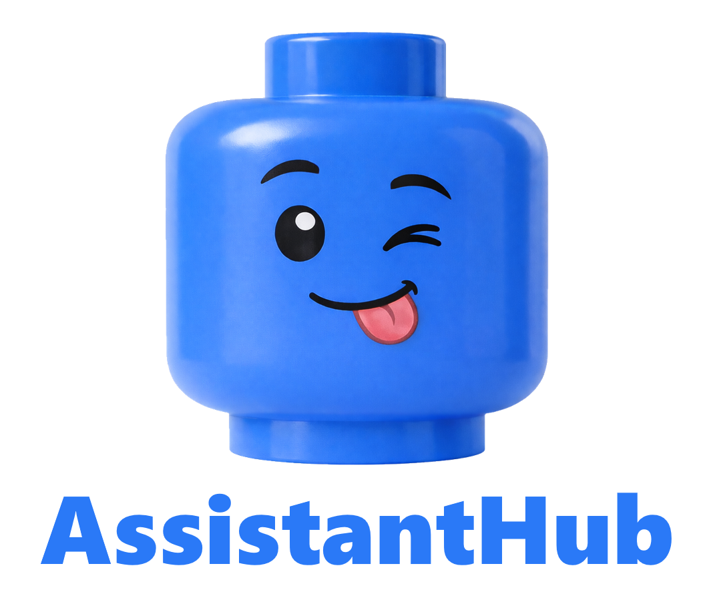

# AssistantHub

<p align="center">
  <br>
  <a href="LICENSE.md"></a>
  
  
</p>

**AssistantHub** is a self-hosted RAG (Retrieval-Augmented Generation) data and chatbot platform. It enables you to create AI assistants that can answer questions grounded in your uploaded documents, powered by vector embeddings, hybrid search, and large language models. Upload PDFs, text files, HTML, and more -- AssistantHub automatically extracts content, summarizes, chunks, generates embeddings, and makes it searchable. Your assistants retrieve relevant context at query time and generate accurate, citation-ready responses.

AssistantHub ships as a fully orchestrated Docker Compose stack -- one command brings up the entire platform, including the LLM inference engine, document processing pipeline, vector database, object storage, and a browser-based management dashboard.

---

## New in v0.2.0

- **Initial release**
- **Multi-assistant platform** -- Create and manage multiple AI assistants, each with independent configuration, personality, knowledge base, and appearance
- **Automated document ingestion pipeline** -- Upload documents (PDF, text, HTML, and more); automatic text extraction via DocumentAtom, chunking and embedding via Partio, and storage in RecallDB
- **Ingestion rules** -- Define reusable ingestion configurations specifying target S3 buckets, RecallDB collections, chunking strategies, optional summarization, and embedding settings
- **Flexible search modes** -- Vector (semantic similarity), full-text (keyword matching), and hybrid search with tunable scoring weights for optimal retrieval
- **LLM-based retrieval gate** -- Optional per-assistant retrieval gate that classifies whether each user message requires new document retrieval or can be answered from existing conversation context
- **Conversation compaction** -- Automatic summarization of older messages when the conversation approaches the context window limit, preserving conversation continuity
- **Streaming chat responses** -- Real-time Server-Sent Events (SSE) streaming for token-by-token response delivery
- **Configurable inference endpoints** -- Support for Ollama (local) and OpenAI (cloud) inference providers, with per-assistant endpoint overrides via managed Partio endpoints
- **Document summarization** -- Optional pre-chunking or post-chunking summarization of document content using configurable completion endpoints
- **Public chat API** -- Unauthenticated OpenAI-compatible chat endpoint for embedding assistants into external applications
- **Feedback collection** -- Thumbs-up/thumbs-down feedback and free-text comments on assistant responses for quality monitoring
- **Chat history and performance metrics** -- Per-turn history with detailed timing measurements: retrieval duration, time to first token, time to last token, tokens per second, compaction duration, and more
- **Browser-based dashboard** -- Full management UI for assistants, documents, ingestion rules, endpoints, feedback, history, collections, buckets, users, and live chat testing
- **Multi-tenant user management** -- Admin and standard user roles with per-user assistant ownership
- **Multiple database backends** -- SQLite (default), PostgreSQL, SQL Server, and MySQL for the application database
- **One-command Docker deployment** -- Fully orchestrated Docker Compose stack with health checks, dependency ordering, and persistent volumes
- Citation metadata in chat completion responses with source attribution

---

## Features

- **Assistants** -- Create and manage multiple AI assistants, each with their own configuration, personality, and knowledge base.
- **Documents** -- Upload documents (PDF, text, HTML, and more) to build a knowledge base for each assistant. Documents are automatically chunked, embedded, and indexed.
- **Ingestion Rules** -- Define reusable ingestion configurations that specify target S3 buckets, RecallDB collections, summarization, chunking strategies, and embedding settings. Documents reference an ingestion rule for processing.
- **Summarization** -- Optionally summarize document content before or after chunking using configurable completion endpoints, improving retrieval quality for long documents.
- **Endpoint Management** -- Manage embedding and completion (inference) endpoints on the Partio service directly from the dashboard or API.
- **Search** -- Leverages pgvector and RecallDB for vector, full-text, and hybrid search. Configure per-assistant search modes with tunable scoring weights for optimal retrieval from your document corpus.
- **Retrieval Gate** -- Optional LLM-based retrieval gate that intelligently decides whether each user message requires a new document search or can be answered from existing conversation context, reducing unnecessary retrieval calls.
- **Chat** -- Public-facing chat endpoint that retrieves relevant context from your documents and generates responses using configurable LLM providers (OpenAI, Ollama). Supports real-time SSE streaming.
- **Conversation Compaction** -- Automatic summarization of older messages when the conversation approaches the context window limit, preserving continuity across long conversations.
- **Feedback** -- Collect thumbs-up/thumbs-down feedback and free-text comments on assistant responses to monitor quality and improve over time.
- **Multi-Tenant** -- User and credential management with admin and standard user roles. Each user owns their own assistants and documents.
- **Dashboard** -- Browser-based management UI for configuring assistants, uploading documents, viewing feedback, managing endpoints, and testing chat.
- **Source citations** -- Optional per-assistant citation metadata that maps model claims to source documents with bracket notation, relevance scores, and text excerpts. Configurable document linking via presigned S3 URLs or authenticated download endpoints

---

## Quick Start (Docker)

The fastest way to run AssistantHub and all its dependencies is with Docker Compose. This is the recommended deployment method.

```bash
cd docker
docker compose up -d
```

Once all services are healthy, open [http://localhost:8801](http://localhost:8801) to access the dashboard.

> **Note:** Deploying individual services outside of Docker is also possible, but requires manual configuration and deployment of each dependency (PostgreSQL with pgvector, Ollama, Less3, DocumentAtom, Partio, RecallDB). The Docker Compose stack handles all service wiring, health checks, and startup ordering automatically, which is why manual setup documentation is not provided.

### Services

The Docker Compose stack orchestrates the following services:

| Service | Port | Description |
|---|---|---|
| **assistanthub-server** | 8800 | The core AssistantHub REST API server (.NET 10). Handles all business logic: assistant management, document ingestion orchestration, chat with RAG, user authentication, and integration with all downstream services. |
| **assistanthub-dashboard** | 8801 | Browser-based management dashboard (React 19, served by nginx). Provides a full UI for configuring assistants, uploading documents, managing endpoints, viewing feedback/history, and live chat testing. Proxies API requests to the server. |
| **ollama** | 11434 | Local LLM inference engine. Runs language models (e.g., `gemma3:4b`) for chat completion, conversation compaction, retrieval gate classification, and title generation. Models are persisted in a Docker volume. |
| **less3** | 8000 | S3-compatible object storage server. Stores uploaded document files. AssistantHub uses the S3 API to write, read, and delete document objects during ingestion and cleanup. |
| **less3-ui** | 8001 | Web-based management UI for Less3. Allows direct browsing and management of S3 buckets and objects. |
| **documentatom-server** | 8301 | Document processing service. Extracts text content from uploaded files (PDF, DOCX, HTML, text, and more), returning structured cells that represent the document's content. |
| **documentatom-dashboard** | 8302 | Web-based management UI for DocumentAtom. |
| **partio-server** | 8321 | Text chunking, embedding, and summarization service. Splits extracted text into chunks using configurable strategies, computes vector embeddings via Ollama, and optionally summarizes content using a completion endpoint. Also manages embedding and completion endpoint configurations. |
| **partio-dashboard** | 8322 | Web-based management UI for Partio. Allows direct management of embedding and completion endpoints. |
| **pgvector** | 5432 | PostgreSQL with the pgvector extension. Provides the underlying vector storage and full-text search capabilities used by RecallDB. Supports cosine similarity search over high-dimensional embedding vectors. |
| **recalldb-server** | 8401 | Vector and full-text search database. Wraps pgvector with a REST API for storing, searching, and managing document embeddings. Supports vector search (semantic similarity), full-text search (keyword matching), and hybrid search (weighted combination). |
| **recalldb-dashboard** | 8402 | Web-based management UI for RecallDB. Allows direct browsing of collections, records, and search testing. |

### Using an External Ollama Instance

If you already have Ollama running on your host machine or on another server, you can skip the containerized Ollama and point AssistantHub at your existing instance instead.

**1. Comment out the Ollama service in `docker/compose.yaml`:**

Comment out (or remove) the `ollama` service and its volume:

```yaml
services:

  # --- Infrastructure ---

  # ollama:
  #   image: ollama/ollama:latest
  #   container_name: ollama
  #   ports:
  #     - "11434:11434"
  #   environment:
  #     OLLAMA_NUM_PARALLEL: "4"
  #     OLLAMA_MAX_LOADED_MODELS: "4"
  #   volumes:
  #     - ollama-models:/root/.ollama
  #   restart: unless-stopped
```

Also comment out the `ollama-models` volume at the bottom of the file:

```yaml
volumes:
  pgvector-data:
  # ollama-models:
```

And remove `- ollama` from the `partio-server` service's `depends_on` list.

**2. Update `docker/assistanthub/assistanthub.json` to point to your Ollama instance:**

In the `Inference` section, change the `Endpoint` from the container hostname to your Ollama instance's address:

```json
"Inference": {
  "Provider": "Ollama",
  "Endpoint": "http://host.docker.internal:11434",
  "ApiKey": "default",
  "DefaultModel": "gemma3:4b"
}
```

- **Ollama on the same machine (Docker Desktop):** Use `http://host.docker.internal:11434`. The special hostname `host.docker.internal` resolves to your host machine from inside Docker containers. Do **not** use `localhost` -- inside a container, `localhost` refers to the container itself, not your host machine.
- **Ollama on the same machine (Linux without Docker Desktop):** Use `http://172.17.0.1:11434` (the default Docker bridge gateway), or run the compose stack with `network_mode: host`. You may also need to set `OLLAMA_HOST=0.0.0.0` in your Ollama configuration so it listens on all interfaces.
- **Ollama on another machine:** Use that machine's IP or hostname, e.g. `http://192.168.1.50:11434`. Ensure the Ollama port is accessible from the Docker network.

**3. Update `docker/partio/partio.json` to point to your Ollama instance:**

In the `DefaultEmbeddingEndpoints` section, change the `Endpoint` from the container hostname to match the address you used above:

```json
"DefaultEmbeddingEndpoints": [
  {
    "Model": "all-minilm",
    "Endpoint": "http://host.docker.internal:11434",
    "ApiFormat": "Ollama",
    "ApiKey": null
  }
]
```

**4. Update embedding and completion endpoints in the Partio dashboard:**

After startup, open the Partio dashboard at [http://localhost:8322](http://localhost:8322) and update **both** the embedding endpoints and completion endpoints to point to your Ollama instance:

- Change the **Endpoint** URL from `http://ollama:11434` to your instance's address (e.g. `http://host.docker.internal:11434`).
- Change the **Health Check URL** from a relative path (`/api/tags`) to a **fully-qualified URL** (e.g. `http://host.docker.internal:11434/api/tags`). Health checks using relative paths will fail with an "invalid request URI" error.

Without these changes, document ingestion (embeddings) and chat completions will fail.

**5. Start the stack:**

```bash
cd docker
docker compose up -d
```

### Dashboards

| Dashboard | URL | Default Credentials |
|---|---|---|
| **AssistantHub** | [http://localhost:8801](http://localhost:8801) | Email: `admin@assistanthub`, Password: `password` |
| **Less3** | [http://localhost:8001](http://localhost:8001) | Admin API Key: `less3admin`, Access Key: `default`, Secret Key: `default` |
| **DocumentAtom** | [http://localhost:8302](http://localhost:8302) | No authentication configured by default |
| **Partio** | [http://localhost:8322](http://localhost:8322) | Email: `admin@partio`, Password: `password`, Admin API Key: `partioadmin` |
| **RecallDB** | [http://localhost:8402](http://localhost:8402) | Email: `admin@recall`, Password: `password`, Admin API Key: `recalldbadmin` |

**Important:** Change all default passwords immediately after first login.

---

## Configuration

The server reads configuration from `assistanthub.json` in the working directory. For Docker deployments, this file is located at `docker/assistanthub/assistanthub.json` and is mounted into the container.

```json
{
  "Webserver": {
    "Hostname": "*",
    "Port": 8800,
    "Ssl": false
  },
  "Database": {
    "Type": "Sqlite",
    "Filename": "./data/assistanthub.db",
    "Hostname": "",
    "Port": 0,
    "DatabaseName": "",
    "Username": "",
    "Password": ""
  },
  "S3": {
    "Region": "USWest1",
    "BucketName": "default",
    "AccessKey": "default",
    "SecretKey": "default",
    "EndpointUrl": "http://less3:8000",
    "UseSsl": false,
    "BaseUrl": "http://less3:8000"
  },
  "DocumentAtom": {
    "Endpoint": "http://documentatom-server:8000",
    "AccessKey": "default"
  },
  "Chunking": {
    "Endpoint": "http://partio-server:8400",
    "AccessKey": "partioadmin",
    "EndpointId": "ep_..."
  },
  "Inference": {
    "Provider": "Ollama",
    "Endpoint": "http://ollama:11434",
    "ApiKey": "default",
    "DefaultModel": "gemma3:4b"
  },
  "RecallDb": {
    "Endpoint": "http://recalldb-server:8600",
    "TenantId": "default",
    "AccessKey": "recalldbadmin"
  },
  "ProcessingLog": {
    "Directory": "./processing-logs/",
    "RetentionDays": 30
  },
  "ChatHistory": {
    "RetentionDays": 7
  },
  "Logging": {
    "ConsoleLogging": true,
    "EnableColors": false,
    "FileLogging": true,
    "LogDirectory": "./logs/",
    "LogFilename": "assistanthub.log",
    "IncludeDateInFilename": true,
    "MinimumSeverity": 1,
    "Servers": []
  }
}
```

### Key Settings

| Section | Description |
|---|---|
| `Webserver` | Hostname, port, and SSL toggle for the HTTP listener. |
| `Database` | Database type (`Sqlite`, `Postgresql`, `SqlServer`, `Mysql`) and connection details. |
| `S3` | S3-compatible object storage (Less3) for uploaded documents. |
| `DocumentAtom` | Endpoint and access key for the DocumentAtom document-processing service. |
| `Chunking` | Endpoint, access key, and default endpoint ID for the Partio chunking/embedding service. |
| `Inference` | LLM provider (`Ollama` or `OpenAI`), endpoint, API key, and default model. |
| `RecallDb` | Endpoint, tenant ID, and access key for the RecallDB vector database service. |
| `ProcessingLog` | Directory and retention for per-document processing logs. |
| `ChatHistory` | Retention period in days for chat history records (0 = keep indefinitely). Background cleanup runs hourly. |
| `Logging` | Console/file logging toggles, severity level, log directory, and optional syslog servers. |

---

## Factory Reset (Docker)

To completely reset AssistantHub to a clean state, use the factory reset script:

```bash
cd docker
docker compose down
cd factory
./reset.sh        # Linux/macOS
reset.bat         # Windows
```

The script will prompt you to type `RESET` to confirm. This destroys all runtime data (databases, uploaded documents, logs, vector data) and restores factory-default databases. Configuration files are preserved. Downloaded Ollama models are kept by default; pass `--include-models` to remove them as well.

After the reset completes, start the environment again:

```bash
cd docker
docker compose up -d
```

---

## API Overview

AssistantHub exposes a versioned REST API at `/v1.0/`. All authenticated endpoints require a bearer token in the `Authorization` header or as a `token` query parameter.

For complete endpoint documentation including request/response schemas and examples, see [REST_API.md](REST_API.md).

### Endpoint Summary

| Category | Endpoints | Description |
|---|---|---|
| Health | `GET /`, `HEAD /` | Server info and health check (unauthenticated) |
| Authentication | `POST /v1.0/authenticate` | Authenticate with email/password or bearer token |
| Users | `PUT/GET /v1.0/users`, `GET/PUT/DELETE/HEAD /v1.0/users/{id}` | User management (admin only) |
| Credentials | `PUT/GET /v1.0/credentials`, `GET/PUT/DELETE/HEAD /v1.0/credentials/{id}` | API credential management (admin only) |
| Buckets | `PUT/GET /v1.0/buckets`, `GET/DELETE/HEAD /v1.0/buckets/{name}` | S3 bucket management (admin only) |
| Bucket Objects | `GET/PUT/POST/DELETE /v1.0/buckets/{name}/objects` | S3 object management with upload, download, metadata, and directory creation (admin only) |
| Collections | `PUT/GET /v1.0/collections`, `GET/PUT/DELETE/HEAD /v1.0/collections/{id}` | RecallDB collection management (admin only) |
| Collection Records | `PUT/GET /v1.0/collections/{id}/records`, `GET/DELETE .../records/{recordId}` | Browse and manage records within collections (admin only) |
| Ingestion Rules | `PUT/GET /v1.0/ingestion-rules`, `GET/PUT/DELETE/HEAD /v1.0/ingestion-rules/{id}` | Document processing rule management |
| Embedding Endpoints | `PUT /v1.0/endpoints/embedding`, `POST .../enumerate`, `GET/PUT/DELETE/HEAD .../{id}`, `GET .../health` | Partio embedding endpoint management (admin only) |
| Completion Endpoints | `PUT /v1.0/endpoints/completion`, `POST .../enumerate`, `GET/PUT/DELETE/HEAD .../{id}`, `GET .../health` | Partio completion endpoint management (admin only) |
| Assistants | `PUT/GET /v1.0/assistants`, `GET/PUT/DELETE/HEAD /v1.0/assistants/{id}` | Assistant management (owner or admin) |
| Assistant Settings | `GET/PUT /v1.0/assistants/{id}/settings` | Per-assistant inference and RAG configuration (owner or admin) |
| Documents | `PUT/GET /v1.0/documents`, `GET/DELETE/HEAD /v1.0/documents/{id}`, `GET .../processing-log` | Document upload, management, and processing log access |
| Feedback | `GET /v1.0/feedback`, `GET/DELETE /v1.0/feedback/{id}` | View and manage user feedback |
| History | `GET /v1.0/history`, `GET/DELETE /v1.0/history/{id}` | View and manage chat history with timing metrics |
| Threads | `GET /v1.0/threads` | List conversation threads |
| Models | `GET /v1.0/models`, `POST /v1.0/models/pull`, `GET .../pull/status` | List, pull, and check pull status for inference models |
| Configuration | `GET/PUT /v1.0/configuration` | View and update server configuration (admin only) |
| Public Chat | `POST /v1.0/assistants/{id}/chat` | Chat completion with RAG (unauthenticated, SSE or JSON) |
| Public Generate | `POST /v1.0/assistants/{id}/generate` | Lightweight inference without RAG (unauthenticated) |
| Public Compact | `POST /v1.0/assistants/{id}/compact` | Force conversation compaction (unauthenticated) |
| Public Feedback | `POST /v1.0/assistants/{id}/feedback` | Submit feedback (unauthenticated) |
| Public Info | `GET /v1.0/assistants/{id}/public` | Get assistant public info and appearance (unauthenticated) |
| Public Threads | `POST /v1.0/assistants/{id}/threads` | Create a conversation thread (unauthenticated) |

---

## Architecture

```
                          ┌──────────────────┐
                          │    Dashboard     │
                          │  (React / Vite)  │
                          │    Port 8801     │
                          └────────┬─────────┘
                                   │
                                   │ HTTP (nginx reverse proxy)
                                   ▼
                          ┌──────────────────┐
                          │  AssistantHub    │
                          │ Server (.NET 10) │
                          │    Port 8800     │
                          └──┬────┬────┬──┬──┘
                             │    │    │  │
              ┌──────────────┘    │    │  └──────────────┐
              │                   │    │                 │
              ▼                   ▼    ▼                 ▼
   ┌──────────────────┐ ┌────────────────┐    ┌──────────────────┐
   │   DocumentAtom   │ │   RecallDB     │    │      Less3       │
   │ (Doc Processing) │ │(Vector Search) │    │  (S3 Storage)    │
   │    Port 8301     │ │   Port 8401    │    │    Port 8000     │
   └────────┬─────────┘ └────────┬───────┘    └──────────────────┘
            │                    │
            ▼                    ▼
   ┌──────────────────┐ ┌──────────────────┐
   │     Partio       │ │    pgvector      │
   │ (Chunk/Embed)    │ │  (PostgreSQL)    │
   │    Port 8321     │ │    Port 5432     │
   └────────┬─────────┘ └──────────────────┘
            │
            ▼
   ┌──────────────────┐
   │     Ollama       │
   │  (LLM Inference) │
   │   Port 11434     │
   └──────────────────┘
```

### Document Ingestion Data Flow

```
  ┌─────────┐       ┌──────────────┐       ┌──────────────┐
  │  User   │       │ AssistantHub │       │    Less3     │
  │(Browser │──1───►│   Server     │──2───►│ (S3 Storage) │
  │  or API)│       │              │       └──────────────┘
  └─────────┘       └──────┬───────┘
                           │
                      3    │
                           ▼
                    ┌──────────────┐
                    │ DocumentAtom │   Extracts text cells
                    │              │   from PDF, DOCX, HTML, etc.
                    └──────┬───────┘
                           │
                      4    │  Text cells
                           ▼
                    ┌──────────────┐
                    │    Partio    │   Optionally summarizes cells,
                    │              │   chunks text, computes embeddings
                    └──────┬───────┘
                           │
                      5    │  Chunks + embeddings
                           ▼
                    ┌──────────────┐
                    │   RecallDB   │   Stores chunks and vectors
                    │  (pgvector)  │   for retrieval
                    └──────────────┘
```

1. User uploads a document via the API or dashboard, selecting an ingestion rule.
2. The document file is stored in the ingestion rule's S3 bucket via Less3.
3. DocumentAtom extracts text content from the document, returning structured cells.
4. Partio processes the cells: optionally summarizes (pre- or post-chunking per the rule), splits into chunks using the rule's chunking strategy, and computes vector embeddings via Ollama.
5. Chunks and embeddings are stored in the ingestion rule's RecallDB collection. Chunk record IDs are saved on the document for cleanup on deletion.

### Chat Data Flow

```
  ┌─────────┐       ┌──────────────┐       ┌──────────────┐
  │  User   │       │ AssistantHub │       │   RecallDB   │
  │(Browser │──1───►│   Server     │──2───►│  (pgvector)  │
  │  or API)│       │              │◄──3───│              │
  └─────────┘       └──────┬───────┘       └──────────────┘
       ▲                   │
       │                4  │  Context + messages
       │                   ▼
       │            ┌──────────────┐
       └─────6──────│    Ollama    │   Generates response
                    │  (Inference) │   (streaming or batch)
                    └──────────────┘
```

1. User sends a message to the chat endpoint with conversation history.
2. If RAG is enabled (and the retrieval gate permits), the server embeds the query and searches RecallDB using the assistant's configured search mode (vector, full-text, or hybrid).
3. RecallDB returns relevant document chunks ranked by similarity score.
4. The server assembles the system prompt with retrieved context and sends the full message list to Ollama (or OpenAI). If the conversation exceeds the context window, older messages are compacted first.
5. The LLM generates a response.
6. The response is streamed back to the user token-by-token via SSE (or returned as a complete JSON response). Chat history with timing metrics is persisted.

---

## Tech Stack

- **Backend:** .NET 10 (C#), WatsonWebserver
- **Frontend:** React 19, Vite 6, JavaScript
- **Database:** SQLite (default), PostgreSQL, SQL Server, MySQL
- **Vector Search:** RecallDB backed by PostgreSQL with pgvector
- **Document Processing:** DocumentAtom (text extraction), Partio (chunking, embedding, summarization)
- **Object Storage:** Less3 (S3-compatible)
- **Inference Providers:** Ollama (local), OpenAI (cloud)
- **Containerization:** Docker, Docker Compose
- **Web Server (Dashboard):** nginx

---

## Issues, Feedback, and Improvements

- **Bug Reports and Feature Requests** -- Use the [Issues](../../issues) tab to report bugs or request new features.
- **Questions and Discussion** -- Use the [Discussions](../../discussions) tab for general questions, ideas, and community feedback.
- **Improvements** -- We are happy to accept pull requests, please keep them focused and short

---

## License

This project is licensed under the MIT License. See [LICENSE.md](LICENSE.md) for details.

Copyright (c) 2026 Joel Christner.
