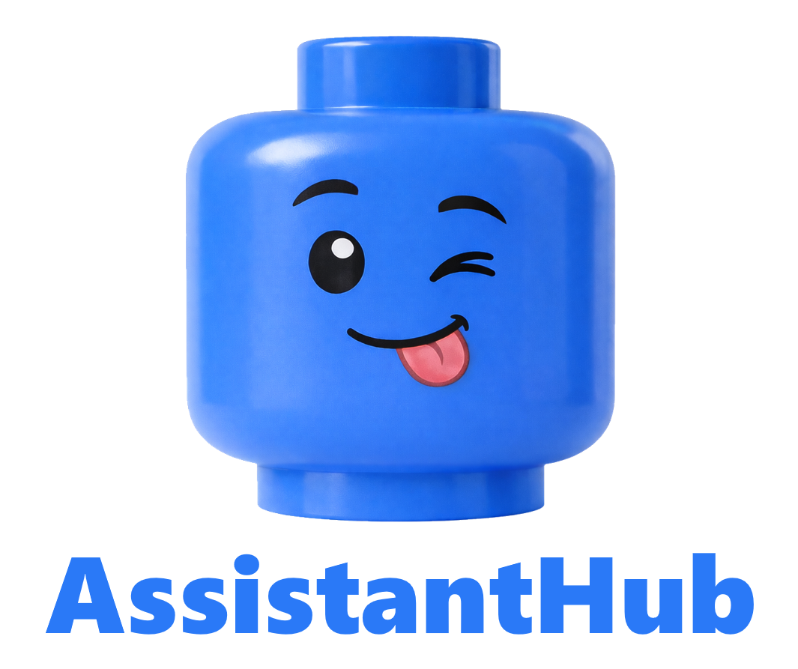
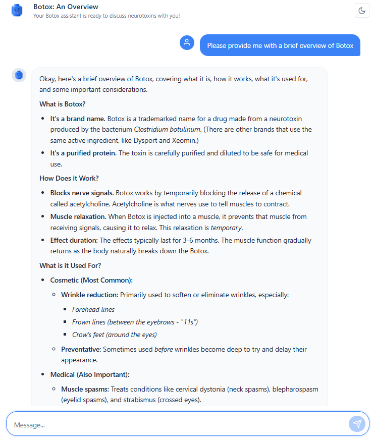
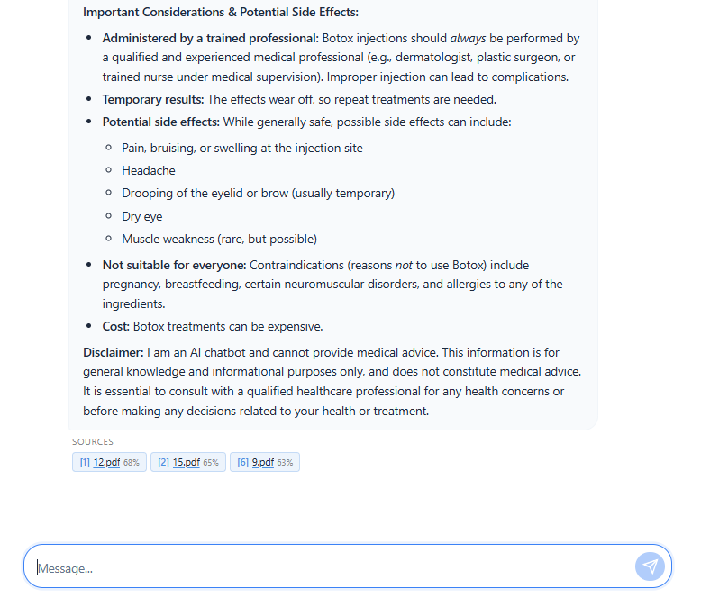
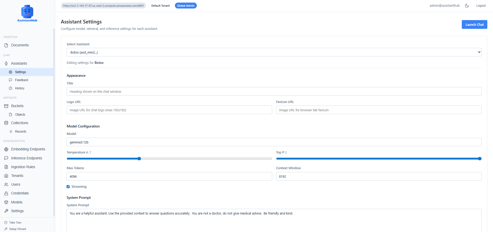
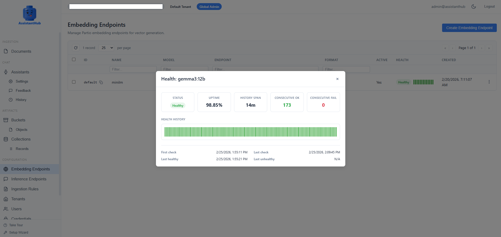
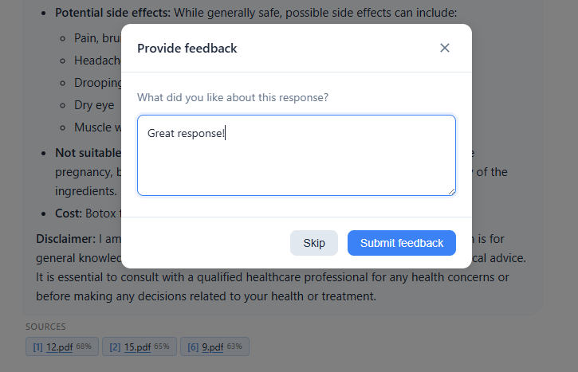
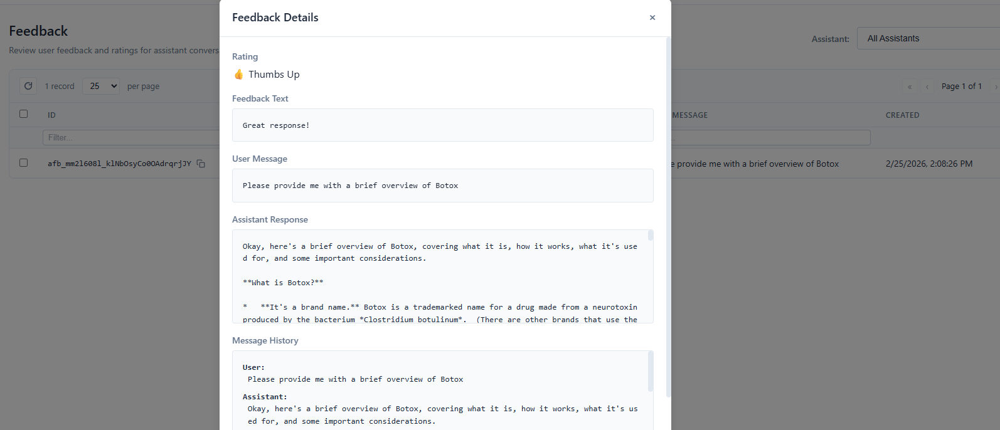
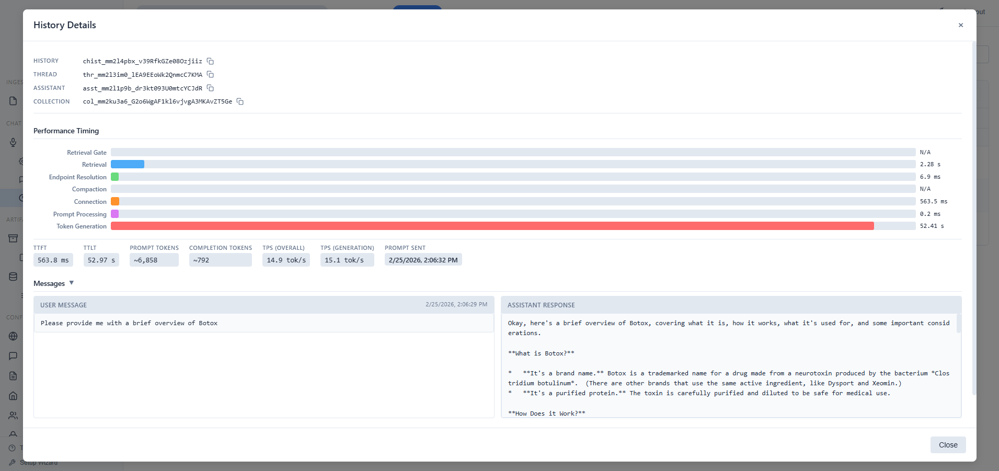
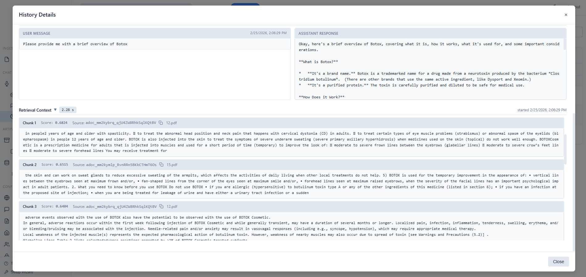

# AssistantHub

<p align="center">
  <br>
  <a href="LICENSE.md"></a>
  
  
</p>

**AssistantHub** is a self-hosted RAG (Retrieval-Augmented Generation) data and chatbot platform. It enables you to create AI assistants that can answer questions grounded in your uploaded documents, powered by vector embeddings, hybrid search, and large language models. Upload PDFs, text files, HTML, and more -- AssistantHub automatically extracts content, summarizes, chunks, generates embeddings, and makes it searchable. Your assistants retrieve relevant context at query time and generate accurate, citation-ready responses.

AssistantHub ships as a fully orchestrated Docker Compose stack -- one command brings up the entire platform, including the LLM inference engine, document processing pipeline, vector database, object storage, and a browser-based management dashboard.

`v0.16.0` adds CIFS and NFS file-server crawler support alongside the existing web crawler, attached-document chat selection for assistant collections, and the first disabled-by-default server-side tool policy surface for model-directed collection, Verbex, S3, and Tavily web-search tools.

<details>
<summary><strong>Screenshots</strong> (click to expand)</summary>
<br>










</details>

---

## New in v0.16.0

- **CIFS and NFS crawlers** -- Crawl plans can target web sites, CIFS/SMB file shares, or NFS exports through the shared crawler lifecycle.
- **Shared crawler architecture** -- `CrawlerBase` now supports lazy content retrieval so web, CIFS, and NFS crawlers share delta, upload, document creation, ingestion, scheduling, and retention behavior.
- **Repository settings contract** -- CIFS and NFS settings are mapped from View's `DataRepository` fields and exposed through REST, OpenAPI, Postman, the dashboard, and C#/TypeScript/Python SDKs.
- **Attached-document chat** -- Public assistant chat clients can list completed documents from the assistant collection and send `attached_document_ids` to constrain RAG retrieval to selected documents for a turn.
- **Tool-call policy foundation** -- Assistant settings now include administrator-controlled tool policy JSON, effective tool previews, validation endpoints, SDK/Postman/OpenAPI coverage, and disabled-by-default Tavily web-search configuration.
- **Tool-call trace history** -- Non-streaming tool calls are persisted as redacted `AssistantToolCallRecord` rows linked to trace, request history, and chat history, with admin REST/Postman/OpenAPI/SDK coverage under `/v1.0/assistants/{assistantId}/tool-calls`. Trace retention follows `RequestHistory.RetentionDays`.

## New in v0.14.0

- **Verbex deployment plumbing** -- Docker Compose includes `jchristn77/verbex-server:v0.1.0` and `jchristn77/verbex-dashboard:v0.1.0`, backed by the shared PostgreSQL service.
- **Inverted-index APIs** -- AssistantHub now has proxied REST routes for indices, index records, index search, and collection search.
- **Collection search API** -- AssistantHub now marshals RecallDB collection search through `POST /v1.0/collections/{collectionId}/search`.
- **Dashboard search surfaces** -- Artifacts includes `Collections > Search`, `Indices`, `Indices > Records`, and `Indices > Search` with filters, metadata editing, result details, scoring, and raw JSON inspection.
- **Implementation plan** -- The remaining whole-product work is tracked in [`archive/SEARCH.md`](archive/SEARCH.md).

## Previous Release Highlights

- **Assistant Analytics dashboard** -- New `Assistants > Analytics` page with per-assistant charts for request volume, success/failure, latency percentiles, stage duration, endpoint/model usage, provider timings, token throughput, retrieval fanout, slowest requests, and feedback trend, scoped to retained Assistant History rows.
- **Analytics REST API** -- Added `GET /v1.0/assistants/{assistantId}/analytics/*` endpoints for overview, time series, stage buckets, endpoint summaries, slowest requests, and feedback analytics.
- **Efficient assistant-scoped telemetry queries** -- `chat_history_performance_events` now carries `assistant_id`, with startup migrations and provider scripts adding backfill and indexes for SQLite, PostgreSQL, MySQL, and SQL Server.
- **SDK and MCP coverage** -- C#, JavaScript/TypeScript, Python, Postman, OpenAPI, and MCP all expose the new assistant analytics read APIs.
- **Schema migration** -- Existing deployments can add analytics indexes and backfill performance events with the matching assistant analytics provider script.

Implementation planning notes for Assistant Analytics are archived in [`archive/ASSISTANT_ANALYTICS.md`](archive/ASSISTANT_ANALYTICS.md).

## New in v0.12.0

- **Assistant performance telemetry** -- Chat history now stores `TraceId`, `RequestHistoryId`, `PerformanceSchemaVersion`, and serialized `PerformanceJson` with per-stage timings, including safe aggregate tool-call counts and duration metadata for tool-enabled turns. The dashboard slowest-request table surfaces aggregate tool failures, denials, truncation counts, and slowest tool names for admin diagnosis.
- **Provider-agnostic hot-path detail** -- Final inference telemetry captures endpoint limiter wait, request-to-headers, headers-to-first-token, first-token-to-last-token, token counts, status, endpoint/model metadata, and provider-native metrics when available.
- **Request/history correlation** -- Request history stores `TraceId` and `ChatHistoryId`, allowing assistant request detail views to drill into linked chat timing.
- **Dashboard drill-down** -- History details and request-history details now include expanded performance timing tables for cold-load and hot-load analysis.
- **Schema migration** -- Existing deployments can add the new telemetry columns and `chat_history_performance_events` table with the matching `migrations/010_upgrade_to_v0.12.0.*.sql` provider script.
- **SDK and API surface** -- C#, JavaScript, and Python SDKs include the new history correlation fields and telemetry DTOs.

## New in v0.11.0

- **Specialized RAG utility endpoints** -- Assistant Settings now has dedicated dropdowns for retrieval gate, query rewrite, and re-rank inference endpoints.
- **Hot-path endpoint honoring** -- Chat execution uses those dedicated endpoints for their matching utility calls and falls back to the response inference endpoint when the specialized selector is empty.
- **API and SDK support** -- `RetrievalGateInferenceEndpointId`, `QueryRewriteInferenceEndpointId`, and `RerankInferenceEndpointId` are available through REST, OpenAPI, Postman, and the C#, JavaScript, and Python SDK models.
- **Migration scripts** -- Existing deployments can add the new assistant settings columns with the matching `migrations/009_upgrade_to_v0.11.0.*.sql` provider script.

## New in v0.10.0

- **API Explorer** -- Browse the live AssistantHub route surface from `/openapi.json`, execute management APIs directly from the dashboard, inspect responses, and generate reusable cURL or JavaScript snippets.
- **Assistant API explorer mode** -- Exercise assistant-facing APIs end-to-end from the dashboard, including public metadata, thread creation, chat, compaction, generation, feedback, and distinct labels or tags.
- **Request History** -- Capture and search request and response metadata across system APIs and assistant traffic with replay into the explorer, retention cleanup, body truncation, and redaction controls.
- **Monitoring surfaces in the dashboard** -- `API Explorer` and `Request History` are included directly in the product under the `Monitoring` section for day-to-day operator use.
- **Migration script** -- Existing deployments can add the new request-history table with `migrations/008_upgrade_to_v0.10.0.sql`.

## API Observability Added In v0.10.0

AssistantHub now includes two operator-facing tools in the dashboard:

- `Request History` for searchable HTTP request and response observability
- `API Explorer` for executing system APIs and assistant-facing APIs against the live server

Operational notes:

- Request-history capture is configurable under `RequestHistory` settings in `assistanthub.json`
- Sensitive headers and selected JSON fields are redacted before persistence
- Request and response bodies are size-limited and binary payloads are summarized rather than stored in full
- The explorer uses the runtime `/openapi.json` route instead of a stale checked-in spec as its source of truth

## New in v0.9.0

- **Slack integration per assistant** -- Configure Slack connectivity directly on assistant settings with `Enable Slack`, app token, bot token, channel ID, start-of-message indicator, and draft connectivity verification.
- **Shared chat execution rail** -- Slack requests reuse the same retrieval, compaction, citation, inference, and history flow as AssistantHub chat instead of a separate inference path.
- **Thread-aware Slack replies** -- Incoming Slack messages map to deterministic AssistantHub threads and replies are posted back to the originating Slack thread.
- **Slack verification API and dashboard flow** -- Added `POST /v1.0/assistants/{assistantId}/settings/slack/verify` plus dashboard support for testing draft values before save.
- **Chat history origin tracking** -- `chat_history.origin` now records request source such as `web` or `slack`.
- **Migration script**: `migrations/007_upgrade_to_v0.9.0.sql`

## Slack Integration Added In v0.9.0

AssistantHub supports per-assistant Slack connectivity through Assistant Settings.

- Enable Slack on an assistant and provide:
  - `App Token` (`xapp-...`)
  - `Bot Token` (`xoxb-...`)
  - `Channel ID`
  - `Start-of-Message Indicator`
- Use `Verify Connectivity` in the dashboard before saving
- AssistantHub maintains one Socket Mode connection per Slack-enabled assistant
- In configured channels, messages are processed when they start with the configured indicator or mention the bot
- Direct messages to the bot are also supported
- Slack conversations reuse the same non-streaming chat execution rail as AssistantHub chat, including retrieval, citations, compaction, and history persistence
- Slack responses are posted back into the originating Slack thread

Operational notes:

- Slack tokens are stored in the AssistantHub database in plaintext, so rely on your deployment's at-rest protections
- The Slack app must have Socket Mode enabled and be invited to any private channels it should service
- AssistantHub consumes the `EasySlack` NuGet package at version `1.0.1`

## New in v0.7.0

- **Metadata filtering for chat completions** -- Filter RAG retrieval to only return documents matching specified labels and/or tags. Labels are simple string lists (required/excluded). Tags are key-value conditions supporting operators: `Equals`, `NotEquals`, `Contains`, `StartsWith`, `EndsWith`, `GreaterThan`, `LessThan`, `IsNull`, `IsNotNull`. Filters can be configured as defaults on an assistant (applied to every conversation) and/or supplied per-request via the `metadata_filter` field on the chat completion request body. When both are present, they are merged (required labels/tags unioned, excluded labels/tags unioned).
- **Per-request `metadata_filter` on chat completions** -- The `POST /v1.0/assistants/{id}/chat` endpoint accepts an optional `metadata_filter` object in the request body. This is an AssistantHub extension to the OpenAI-compatible chat schema. Clients that omit it get standard unfiltered retrieval. Example:
  ```json
  {
    "messages": [{"role": "user", "content": "What were the Q4 results?"}],
    "metadata_filter": {
      "required_labels": ["finance", "quarterly-report"],
      "excluded_labels": ["draft"],
      "required_tags": [
        {"key": "department", "condition": "Equals", "value": "accounting"}
      ]
    }
  }
  ```
- **Assistant-level default filters** -- New `RetrievalLabelFilter` and `RetrievalTagFilter` settings on each assistant. Configure via the dashboard (Retrieval Filters section) or API. These defaults are applied to every chat retrieval for that assistant.
- **Filter discovery endpoints** -- Four new API endpoints to discover available filter values:
  - `GET /v1.0/collections/{collectionId}/labels/distinct` (admin)
  - `GET /v1.0/collections/{collectionId}/tags/distinct` (admin)
  - `GET /v1.0/assistants/{assistantId}/labels/distinct` (public)
  - `GET /v1.0/assistants/{assistantId}/tags/distinct` (public)
- **Dashboard** -- Retrieval Filters configuration in assistant settings, collapsible metadata filter panel in the chat UI for per-session filtering, and metadata filter display in the history detail view
- **Auditing** -- The effective merged filter is stored in `ChatHistory.MetadataFilter` and displayed in the History View modal
- **Docker image tags** updated to v0.7.0
- See [CHANGELOG.md](CHANGELOG.md) for full details

## v0.6.0

- **LLM-based re-ranking** -- After initial retrieval, an LLM scores each chunk's relevance to the user's query and filters out low-quality results before context injection
- See [CHANGELOG.md](CHANGELOG.md) for full details

## v0.5.0

- **Native web crawlers** -- Built-in web crawling engine that automatically discovers, retrieves, and ingests website content. Configure a URL, schedule, and ingestion rule, and AssistantHub handles the rest
- **Crawl plans and scheduling** -- Persistent crawler configurations with automatic recurring execution on configurable intervals (one-time, minutes, hours, days, weeks)
- **Delta-based crawling** -- Subsequent crawls compare against the previous enumeration to process only new, changed, and deleted content
- **Document traceability** -- Every crawled document is linked back to its source crawler and operation. Filter the Documents view by crawler to see all ingested content
- **On-demand controls** -- Start, stop, test connectivity, and preview discovered content from the dashboard or API
- **Full dashboard integration** -- Crawlers management view, operations viewer with statistics, enumeration browser, and Documents view integration
- **16 new API endpoints** -- Complete CRUD, lifecycle control, statistics, and enumeration access for crawl plans and operations
- See [CHANGELOG.md](CHANGELOG.md) for full details

## v0.4.0

- **Query rewrite** -- LLM-based query rewriting for improved retrieval recall
- **Full multi-tenancy** -- Row-level tenant isolation, three-tier authorization, auto-provisioning, tenant-scoped routes
- See [CHANGELOG.md](CHANGELOG.md) for full details

## v0.3.0

- **Initial release** with multi-assistant platform, automated document ingestion, flexible search modes, streaming chat, and browser-based dashboard
- See [CHANGELOG.md](CHANGELOG.md) for full details

---

## Features

- **Assistants** -- Create and manage multiple AI assistants, each with their own configuration, personality, and knowledge base.
- **Documents** -- Upload documents (PDF, text, HTML, and more) to build a knowledge base for each assistant. Documents are automatically chunked, embedded, and indexed.
- **Crawlers** -- Native web, CIFS/SMB, and NFS crawling engine that automatically discovers, retrieves, and ingests repository content on a schedule. Supports delta-based crawling (only new/changed/deleted content is processed), configurable depth, parallelism, throttling, content filtering, web authentication, and CIFS/NFS connectivity validation. Each crawled document is traceable back to its source crawler and operation.
- **Ingestion Rules** -- Define reusable ingestion configurations that specify target S3 buckets, RecallDB collections, summarization, chunking strategies, and embedding settings. Documents reference an ingestion rule for processing.
- **Summarization** -- Optionally summarize document content before or after chunking using configurable completion endpoints, improving retrieval quality for long documents.
- **Endpoint Management** -- Manage, test, and explicitly load or warm embedding and completion (inference) endpoint models on the Partio service directly from the dashboard or API.
- **Search** -- Leverages Verbex for TF-IDF/text document search and pgvector/RecallDB for vector, full-text, and hybrid retrieval. Configure per-assistant search modes with tunable scoring weights for optimal retrieval from your document corpus.
- **Retrieval Gate** -- Optional LLM-based retrieval gate that intelligently decides whether each user message requires a new document search or can be answered from existing conversation context, reducing unnecessary retrieval calls.
- **Chat** -- Public-facing chat endpoint that retrieves relevant context from your documents and generates responses using configurable LLM providers (Ollama, OpenAI, Gemini). Supports real-time SSE streaming, metadata filters, and optional `attached_document_ids` that constrain retrieval to selected assistant documents.
- **Conversation Compaction** -- Automatic summarization of older messages when the conversation approaches the context window limit, preserving continuity across long conversations.
- **Feedback** -- Collect thumbs-up/thumbs-down feedback and free-text comments on assistant responses to monitor quality and improve over time.
- **Multi-Tenant** -- Full row-level tenant isolation with three-tier authorization (Global Admin via API key or `IsAdmin` flag, Tenant Admin, User). Auto-provisioning of tenant resources, per-tenant S3 bucket isolation (`{tenantId}_` prefix), and tenant-scoped RecallDB mapping.
- **Dashboard** -- Browser-based management UI for configuring assistants, uploading documents, viewing feedback, managing endpoints, and testing chat.
- **Model Context Protocol (MCP)** -- Standalone MCP server for the platform management surface with HTTP, TCP, and WebSocket transports, Claude/Cursor install support, default secret redaction for sensitive fields, and binary wrappers for document and bucket-object flows.
- **Query rewrite** -- Optionally rewrite user queries into multiple semantically varied phrasings before retrieval to broaden recall and capture synonyms, alternate phrasing, and conceptual restatements
- **LLM-based re-ranking** -- Re-ranking scores each retrieved chunk for relevance using an LLM, filtering low-quality results before context injection.
- **Metadata filtering** -- Filter RAG retrieval by document labels (required/excluded string lists) and tags (key-value conditions with conditional operators). Configure default filters per assistant and/or override per-conversation via the `metadata_filter` field on chat completion requests.
- **Tool policy controls** -- Assistant owners/admins can save and validate disabled-by-default model tool policies, set assistant-level Tavily overrides, mark completion endpoints as explicitly tool-capable, and inspect effective tool availability. Assistant chat can expose enabled server-side tools to explicit OpenAI-compatible or Ollama tool-capable endpoints, execute requested tools on the server, enforce per-turn tool budgets including S3 object byte caps, and return structured tool outputs to the model. Streaming chat emits safe tool progress events and final answer chunks for tool-enabled turns; live Docker/provider/browser validation remains tracked in `TOOL_CALLS.md`.
- **Source citations** -- Optional per-assistant citation metadata that maps model claims to source documents and citation-capable tool evidence with bracket notation, relevance scores, text excerpts, and web URLs when web search contributes evidence. Configurable document linking via presigned S3 URLs or authenticated download endpoints
- **RAG evaluation** -- Built-in evaluation framework for measuring retrieval and response quality. Define ground-truth facts (question/expected-facts pairs) per assistant, run automated evaluation passes with LLM-based judging, and review per-fact results with pass/fail verdicts. Supports custom judge prompts and real-time SSE progress streaming.

---

## Admin Tool-Policy Workflow

1. Mark the selected completion endpoint as tool-capable only when the backend is known to support model tool calls. Use `OpenAIChatCompletions` for OpenAI-compatible chat-completions endpoints or `OllamaChat` for Ollama.
2. Open Assistant Settings, keep `EnableToolCalls` disabled by default, then enable only the tool groups the assistant should use: collection search/read/enumeration, Verbex search/enumeration, document-backed S3 reads, explicitly opted-in bucket-wide S3 reads, bucket enumeration, and Tavily web search.
3. Set per-tool caps and allow-lists in `ToolPolicyJson`, then use the effective tool list, validation route, and admin dry-run diagnostics route to confirm which tools and endpoint capabilities are available. Completion endpoint tool-call capability is configured through AssistantHub fields and persisted on the Partio endpoint using reserved labels/tags. Collection search may optionally use `EnableServerGeneratedQueryVariants` to add deterministic punctuation/quote-normalized variants within `MaxSearchQueriesPerCall`; `MaxDocumentsConsideredPerSearch` and `MaxResultsConsideredPerSearch` bound exhaustive search work, and real tool timeouts fail with `ErrorCode=timeout`. `ReturnFullSearchContent` stays `false` by default so search returns excerpts and exact text is requested through `collection_read_chunks`. Search metadata includes searched queries/modes plus `DocumentsConsidered` and `ResultsConsidered` when available. Validation returns stable `ErrorCodes` such as `invalid_tool_policy_json`, `unknown_allowed_tool`, `no_tool_enabled`, and `no_available_tools`; diagnostics also checks the selected completion endpoint for explicit tool-call capability without executing tools. Tavily can use assistant-level endpoint/API-key overrides, or fall back to system-wide `ExternalSearch` settings.
4. Test with non-streaming chat first, then validate streaming chat if browser users should see safe tool progress statuses. Streaming chat emits started, heartbeat, completed, failed, and denied tool-status events without raw arguments or outputs; recoverable failures return stable `ErrorCode` values such as `invalid_arguments`, `policy_denial`, `provider_missing`, `provider_http_error`, and `timeout`. Browser clients should mark interrupted streams clearly instead of leaving a pending spinner. Admins can inspect redacted tool-call records under assistant tool-call history and linked request-history/chat-history details.
5. Provider usage metadata is preserved when available. OpenAI-compatible prompt, completion, total, reasoning-token, and tool-definition-token counters are normalized into assistant performance telemetry and exposed through SDK response models.

Dashboard i18n baseline: the current AssistantHub dashboard remains English-only and does not yet include the required `i18next` runtime. New tool-call UI strings follow the existing dashboard convention, while server-driven tool feedback uses stable `status_code` values plus safe display labels so a future i18n pass can localize client text without changing persisted or wire-level event semantics.

---

## Quick Start (Docker)

The fastest way to run AssistantHub and all its dependencies is with Docker Compose. This is the recommended deployment method. The Docker deployment uses PostgreSQL by default for AssistantHub, Less3, Partio, RecallDB, and Verbex metadata.

```bash
cd docker
docker compose up -d
```

Once all services are healthy, open [http://localhost:8801](http://localhost:8801) to access the dashboard.

On a fresh startup, `assistanthub-server` now waits for `partio-server` to become healthy before it starts. This avoids the transient `partio-server:8400` DNS/startup race that could previously abort AssistantHub startup immediately after a factory reset.

For CIFS/NFS crawl plans in the local Docker deployment, remember that `localhost` from inside `assistanthub-server` means the container, not the host machine. The default compose file maps `host.docker.internal` to the Docker host, and AssistantHub normalizes loopback file-server hostnames to that alias when it is available so local shares such as `//localhost/Share` can be reached from the server container.

> **Note:** Deploying individual services outside of Docker is also possible, but requires manual configuration and deployment of each dependency (PostgreSQL with pgvector, Ollama, Less3, DocumentAtom, Partio, RecallDB, Verbex). The Docker Compose stack handles all service wiring, health checks, and startup ordering automatically, which is why manual setup documentation is not provided.

### Services

The Docker Compose stack orchestrates the following services:

| Service | Port | Description |
|---|---|---|
| **assistanthub-server** | 8800 | The core AssistantHub REST API server (.NET 10). Handles all business logic: assistant management, document ingestion orchestration, chat with RAG, user authentication, and integration with all downstream services. |
| **assistanthub-mcp-server** | 8820 / 8821 / 8822 | Standalone Voltaic-based MCP server for AssistantHub. Exposes tenants, users, credentials, assistants, settings, storage, ingestion, endpoints, crawl, eval, history, request history, and runtime configuration over HTTP, TCP, and WebSocket MCP transports. |
| **assistanthub-dashboard** | 8801 | Browser-based management dashboard (React 19, served by nginx). Provides a full UI for configuring assistants, uploading documents, managing endpoints, viewing feedback/history, and live chat testing. Proxies API requests to the server. |
| **ollama** | 11434 | Local LLM inference engine. Runs language models (e.g., `gemma3:4b`) for chat completion, conversation compaction, retrieval gate classification, and title generation. Models are persisted in a Docker volume. |
| **less3** | 8000 | S3-compatible object storage server. Stores uploaded document files. AssistantHub uses the S3 API to write, read, and delete document objects during ingestion and cleanup. |
| **less3-ui** | 8001 | Web-based management UI for Less3. Allows direct browsing and management of S3 buckets and objects. |
| **documentatom-server** | 8301 | Document processing service. Extracts text content from uploaded files (PDF, DOCX, HTML, text, and more), returning structured cells that represent the document's content. |
| **documentatom-dashboard** | 8302 | Web-based management UI for DocumentAtom. |
| **partio-server** | 8321 | Text chunking, embedding, and summarization service. Splits extracted text into chunks using configurable strategies, computes vector embeddings via configurable embedding endpoints, and optionally summarizes content using a completion endpoint. Also manages embedding and completion endpoint configurations. |
| **partio-dashboard** | 8322 | Web-based management UI for Partio. Allows direct management of embedding and completion endpoints. |
| **postgres** | 5432 | PostgreSQL with the pgvector extension. Provides separate databases for AssistantHub, Less3, Partio, RecallDB, and Verbex. |
| **postgres-init** | n/a | One-shot initialization verifier that creates service roles/databases, installs `vector` for RecallDB, and verifies service-role connectivity before app services start. |
| **recalldb-server** | 8401 | Vector and full-text search database. Wraps PostgreSQL/pgvector with a REST API for storing, searching, and managing document embeddings. Supports vector search (semantic similarity), full-text search (keyword matching), and hybrid search (weighted combination). |
| **recalldb-dashboard** | 8402 | Web-based management UI for RecallDB. Allows direct browsing of collections, records, and search testing. |
| **verbex-server** | 8501 | Inverted-index search server. Stores document text records and supports TF-IDF/text search through AssistantHub proxy APIs. |
| **verbex-dashboard** | 8502 | Web-based management UI for Verbex. Allows direct browsing of indices, records, and search testing. |

### Docker PostgreSQL Defaults

The Docker stack uses a single `postgres` container with a named `postgres-data` volume. `postgres-init` creates separate databases and application roles before AssistantHub, Less3, Partio, RecallDB, and Verbex start.
The compose stack starts PostgreSQL with `max_connections=250` so concurrent document ingestion, Verbex indexing, RecallDB embedding writes, object storage, and dashboard/API activity have enough connection headroom during crawler bursts.

| Service | Database | Role |
|---|---|---|
| AssistantHub | `assistanthub` | `assistanthub_app` |
| Less3 | `less3` | `less3_app` |
| Partio | `partio` | `partio_app` |
| RecallDB | `recalldb` | `recalldb_app` |
| Verbex | `verbex` | `verbex_app` |

Local-only database defaults are in `docker/.env` and are mirrored in the mounted JSON config files. Keep those values synchronized if you change database names or credentials.

Troubleshooting:

- If `postgres` is unhealthy, inspect `docker logs assistanthub-postgres` and confirm port `5432` is not already bound by another local database.
- If `postgres-init` fails, inspect `docker logs assistanthub-postgres-init`; failures usually indicate a credential drift between `docker/.env` and the service JSON files, a stale volume, or a missing `vector` extension.
- If stale SQLite files exist under `docker/assistanthub/data`, `docker/less3`, or `docker/partio/data`, they are ignored by the current compose file. Run `docker/factory/reset.bat` or `docker/factory/reset.sh` to remove them while resetting the deployment.

Use `docker/status.bat` or `docker/status.sh` to view the local container ID, name, creation time, status, and published ports without the image and command columns from the default `docker ps -a` output.

### Using an External Ollama Instance

If you already have Ollama running on your host machine or on another server, you can skip the containerized Ollama and point AssistantHub at your existing instance instead.

**1. Comment out the Ollama service in `docker/compose.yaml`:**

Comment out (or remove) the `ollama` and `ollama-init` services and the Ollama model volume:

```yaml
services:

  # --- Infrastructure ---

  # ollama:
  #   image: ollama/ollama:0.30.4
  #   container_name: ollama
  #   ports:
  #     - "11434:11434"
  #   environment:
  #     OLLAMA_NUM_PARALLEL: "4"
  #     OLLAMA_MAX_LOADED_MODELS: "4"
  #   volumes:
  #     - ollama-models:/root/.ollama
  #   restart: unless-stopped
```

Also comment out the `ollama-models` volume at the bottom of the file:

```yaml
volumes:
  postgres-data:
  # ollama-models:
```

And remove `ollama-init` from the `partio-server` service's `depends_on` list.

**2. Update `docker/assistanthub/assistanthub.json` to point to your Ollama instance:**

In the `Inference` section, change the `Endpoint` from the container hostname to your Ollama instance's address:

```json
"Inference": {
  "Provider": "Ollama",
  "Endpoint": "http://host.docker.internal:11434",
  "ApiKey": "default",
  "DefaultModel": "gemma3:4b"
}
```

- **Ollama on the same machine (Docker Desktop):** Use `http://host.docker.internal:11434`. The special hostname `host.docker.internal` resolves to your host machine from inside Docker containers. Do **not** use `localhost` -- inside a container, `localhost` refers to the container itself, not your host machine.
- **Ollama on the same machine (Linux without Docker Desktop):** Use `http://172.17.0.1:11434` (the default Docker bridge gateway), or run the compose stack with `network_mode: host`. You may also need to set `OLLAMA_HOST=0.0.0.0` in your Ollama configuration so it listens on all interfaces.
- **Ollama on another machine:** Use that machine's IP or hostname, e.g. `http://192.168.1.50:11434`. Ensure the Ollama port is accessible from the Docker network.

**3. Update `docker/partio/partio.json` to point to your Ollama instance:**

In the `DefaultEmbeddingEndpoints` section, change the `Endpoint` from the container hostname to match the address you used above:

```json
"DefaultEmbeddingEndpoints": [
  {
    "Model": "all-minilm",
    "Endpoint": "http://host.docker.internal:11434",
    "ApiFormat": "Ollama",
    "ApiKey": null
  }
]
```

**4. Update embedding and completion endpoints in the Partio dashboard:**

After startup, open the Partio dashboard at [http://localhost:8322](http://localhost:8322) and update **both** the embedding endpoints and completion endpoints to point to your Ollama instance:

- Change the **Endpoint** URL from `http://ollama:11434` to your instance's address (e.g. `http://host.docker.internal:11434`).
- Change the **Health Check URL** from a relative path (`/api/tags`) to a **fully-qualified URL** (e.g. `http://host.docker.internal:11434/api/tags`). Health checks using relative paths will fail with an "invalid request URI" error.

Without these changes, document ingestion (embeddings) and chat completions will fail.

**5. Start the stack:**

```bash
cd docker
docker compose up -d
```

### Dashboards

| Dashboard | URL | Default Credentials |
|---|---|---|
| **AssistantHub** | [http://localhost:8801](http://localhost:8801) | Email: `admin@assistanthub`, Password: `password` |
| **Less3** | [http://localhost:8001](http://localhost:8001) | Admin API Key: `less3admin`, Access Key: `default`, Secret Key: `default` |
| **DocumentAtom** | [http://localhost:8302](http://localhost:8302) | No authentication configured by default |
| **Verbex** | [http://localhost:8502](http://localhost:8502) | Admin API Key: `verbexadmin` |
| **Partio** | [http://localhost:8322](http://localhost:8322) | Email: `admin@partio`, Password: `password`, Admin API Key: `partioadmin` |
| **RecallDB** | [http://localhost:8402](http://localhost:8402) | Email: `admin@recall`, Password: `password`, Admin API Key: `recalldbadmin` |

**Important:** Change all default passwords immediately after first login.

Verbex powers text/TF-IDF document search in `ARTIFACTS > Indices > Search`. The dashboard requests Verbex matched terms, per-term score/frequency details, and document term statistics so results can show unique terms, total term occurrences, matched query terms, and score details. The dashboard also includes `ARTIFACTS > Indices` for index metadata/top terms and `ARTIFACTS > Indices > Records` for browsing, creating, updating labels/tags/custom metadata, and deleting Verbex records through AssistantHub. Search result detail modals expose copyable IDs and JSON payloads for inspection. RecallDB collection search remains available in `ARTIFACTS > Collections > Search` with full-text, vector, label/tag, term, date, document, neighbor, and continuation-token controls. Ingestion rules can optionally set `VerbexIndexId`; leaving it blank uses the tenant default Verbex index.

### Search Backfill

New document ingestion indexes extracted text into Verbex automatically when `Verbex.EnableIngestion` is enabled. Existing completed documents from deployments upgraded to `v0.14.0` need a one-time admin reindex before they appear in `ARTIFACTS > Indices > Search`.

Reindex one document:

```bash
curl -X POST http://localhost:8800/v1.0/documents/{documentId}/reindex \
  -H "Authorization: Bearer <admin-token>" \
  -H "Content-Type: application/json" \
  -d "{}"
```

Reindex a bounded page of completed documents:

```bash
curl -X POST "http://localhost:8800/v1.0/documents/reindex?maxResults=100" \
  -H "Authorization: Bearer <admin-token>" \
  -H "Content-Type: application/json" \
  -d "{\"IncludeAlreadyIndexed\":false}"
```

Repeat the batch call with the returned `ContinuationToken` until `EndOfResults` is `true`. Set `IncludeAlreadyIndexed` to `true` to repair or replace existing Verbex records. To verify search, upload or reindex a text document, then search the target index from `ARTIFACTS > Indices > Search` or call `POST /v1.0/indices/{indexId}/search` with a term from the document.

---

## Configuration

The server reads configuration from `assistanthub.json` in the working directory. For Docker deployments, this file is located at `docker/assistanthub/assistanthub.json` and is mounted into the container.

```json
{
  "Webserver": {
    "Hostname": "*",
    "Port": 8800,
    "Ssl": false
  },
  "Database": {
    "Type": "Postgresql",
    "Filename": "",
    "Hostname": "postgres",
    "Port": 5432,
    "DatabaseName": "assistanthub",
    "Username": "assistanthub_app",
    "Password": "assistanthub_password",
    "Schema": "public",
    "RequireEncryption": false,
    "LogQueries": false
  },
  "S3": {
    "Region": "USWest1",
    "BucketName": "default",
    "AccessKey": "default",
    "SecretKey": "default",
    "EndpointUrl": "http://less3:8000",
    "UseSsl": false,
    "BaseUrl": "http://less3:8000"
  },
  "DocumentAtom": {
    "Endpoint": "http://documentatom-server:8000",
    "AccessKey": "default"
  },
  "Chunking": {
    "Endpoint": "http://partio-server:8400",
    "AccessKey": "partioadmin",
    "EndpointId": "default"
  },
  "Embeddings": {
    "Endpoint": "http://partio-server:8400",
    "AccessKey": "partioadmin",
    "EndpointId": "default"
  },
  "Inference": {
    "Provider": "Ollama",
    "Endpoint": "http://ollama:11434",
    "ApiKey": "default",
    "DefaultModel": "gemma3:4b"
  },
  "RecallDb": {
    "Endpoint": "http://recalldb-server:8600",
    "AccessKey": "recalldbadmin",
    "SupportsMultiDocumentFilter": true
  },
  "Verbex": {
    "Endpoint": "http://verbex-server:8080",
    "AccessKey": "verbexadmin",
    "DashboardUrl": "http://localhost:8502",
    "DefaultIndexId": "default",
    "EnableIngestion": true,
    "RequireIngestion": true,
    "MaxContentCharacters": 0
  },
  "ExternalSearch": {
    "Enabled": false,
    "AllowFallback": true,
    "MaxResults": 10,
    "TimeoutMs": 30000,
    "SafeSearch": true,
    "AllowRawContent": false,
    "IncludeDomains": [],
    "ExcludeDomains": [],
    "Providers": [
      {
        "Name": "default",
        "ProviderType": "Tavily",
        "Endpoint": "https://api.tavily.com/search",
        "ApiKey": "${TAVILY_API_KEY}",
        "Enabled": false,
        "IsDefault": true,
        "TimeoutMs": 30000
      }
    ]
  },
  "AdminApiKeys": [
    "changeme"
  ],
  "DefaultTenant": {
    "Id": "default",
    "Name": "Default"
  },
  "ProcessingLog": {
    "Directory": "./processing-logs/",
    "RetentionDays": 30
  },
  "ChatHistory": {
    "RetentionDays": 7
  },
  "Crawl": {
    "EnumerationDirectory": "./crawl-enumerations/"
  },
  "Logging": {
    "ConsoleLogging": true,
    "EnableColors": false,
    "FileLogging": true,
    "LogDirectory": "./logs/",
    "LogFilename": "assistanthub.log",
    "IncludeDateInFilename": true,
    "MinimumSeverity": 1,
    "Servers": []
  }
}
```

### Key Settings

| Section | Description |
|---|---|
| `Webserver` | Hostname, port, and SSL toggle for the HTTP listener. |
| `Database` | Database type (`Sqlite`, `Postgresql`, `SqlServer`, `Mysql`) and connection details. |
| `S3` | S3-compatible object storage (Less3) for uploaded documents. |
| `DocumentAtom` | Endpoint and access key for the DocumentAtom document-processing service. |
| `Chunking` | Endpoint, access key, and default endpoint ID for the Partio chunking service. |
| `Embeddings` | Endpoint, access key, and default endpoint ID for the Partio embeddings service. |
| `Inference` | LLM provider (`Ollama`, `OpenAI`, or `Gemini`), endpoint, API key, and default model. |
| `RecallDb` | Endpoint, access key, dashboard URL, and capability flags for the RecallDB vector database service. `SupportsMultiDocumentFilter` defaults to `true`; set it to `false` only for RecallDB deployments that do not accept native `DocumentIds` search filters, which makes AssistantHub loop over single-document searches and log a fallback warning. |
| `Verbex` | Endpoint, access key, dashboard URL, default index ID, and ingestion failure policy for Verbex text search. |
| `ExternalSearch` | Disabled-by-default external web-search providers. Tavily uses `ProviderType: "Tavily"` and can read `ApiKey` from `${TAVILY_API_KEY}` when globally enabled and exposed through assistant tool policy. Both factory and runtime Docker server JSON files include the disabled Tavily provider placeholder. Admins can check redacted readiness counts with `GET /v1.0/configuration/external-search/status`. |
| `AdminApiKeys` | List of API keys that grant global admin access (not tied to any tenant). Users with `IsAdmin=true` also receive global admin privileges. |
| `DefaultTenant` | ID and name for the default tenant, auto-created on first run. |
| `ProcessingLog` | Directory and retention for per-document processing logs (namespaced by tenant). |
| `ChatHistory` | Retention period in days for chat history records (0 = keep indefinitely). Background cleanup runs hourly. |
| `Crawl` | Directory for storing crawl enumeration files (delta snapshots used for change detection between crawl runs). |
| `Logging` | Console/file logging toggles, severity level, log directory, and optional syslog servers. |

---

## Factory Reset (Docker)

To completely reset AssistantHub to a clean state, use the factory reset script:

```bash
cd docker
docker compose down
cd factory
./reset.sh        # Linux/macOS
reset.bat         # Windows
```

The script will prompt you to type `RESET` to confirm. This destroys all runtime data (PostgreSQL data, uploaded documents, logs, request history, and Verbex runtime data) and restores factory-default configuration files. Downloaded Ollama models are kept by default; pass `--include-models` to remove them as well.

After the reset completes, start the environment again:

```bash
cd docker
docker compose up -d
```

Expected behavior after reset:

- `postgres-init` must complete before database-backed services start
- `assistanthub-server` will not start until `partio-server` is healthy
- this is intentional and prevents AssistantHub from failing early while validating chunking and embeddings connectivity
- if startup appears slower than before, wait for Partio to finish its health checks and model initialization

---

## API Overview

AssistantHub exposes a versioned REST API at `/v1.0/`. All authenticated endpoints require a bearer token in the `Authorization` header or as a `token` query parameter.

For complete endpoint documentation including request/response schemas and examples, see [REST_API.md](REST_API.md).

### Endpoint Summary

| Category | Endpoints | Description |
|---|---|---|
| Health | `GET /`, `HEAD /` | Server info and health check (unauthenticated) |
| Authentication | `POST /v1.0/authenticate` | Authenticate with email/password (+ optional TenantId) or bearer token |
| WhoAmI | `GET /v1.0/whoami` | Return current authentication context (tenant, role, user) |
| Tenants | `PUT/GET /v1.0/tenants`, `GET/PUT/DELETE/HEAD /v1.0/tenants/{id}` | Tenant management (global admin only) |
| Users | `PUT/GET /v1.0/tenants/{tenantId}/users`, `GET/PUT/DELETE/HEAD .../users/{id}` | Tenant-scoped user management |
| Credentials | `PUT/GET /v1.0/tenants/{tenantId}/credentials`, `GET/PUT/DELETE/HEAD .../credentials/{id}` | Tenant-scoped credential management |
| Buckets | `PUT/GET /v1.0/buckets`, `GET/DELETE/HEAD /v1.0/buckets/{name}` | S3 bucket management (tenant-scoped by `{tenantId}_` prefix) |
| Bucket Objects | `GET/PUT/POST/DELETE /v1.0/buckets/{name}/objects` | S3 object management with upload, download, metadata, and directory creation (tenant-scoped) |
| Collections | `PUT/GET /v1.0/collections`, `GET/PUT/DELETE/HEAD /v1.0/collections/{id}` | RecallDB collection management (admin only) |
| Collection Records | `PUT/GET /v1.0/collections/{id}/records`, `GET/DELETE .../records/{recordId}` | Browse and manage records within collections (admin only) |
| Collection Metadata | `GET /v1.0/collections/{id}/labels/distinct`, `GET .../tags/distinct` | Discover distinct label values and tag keys in a collection (admin only) |
| Ingestion Rules | `PUT/GET /v1.0/ingestion-rules`, `GET/PUT/DELETE/HEAD /v1.0/ingestion-rules/{id}` | Document processing rule management |
| Embedding Endpoints | `PUT /v1.0/endpoints/embedding`, `POST .../enumerate`, `GET/PUT/DELETE/HEAD .../{id}`, `GET .../health`, `POST .../test`, `POST .../load` | Partio embedding endpoint management, smoke testing, and model load/warm actions (admin only) |
| Completion Endpoints | `PUT /v1.0/endpoints/completion`, `POST .../enumerate`, `GET/PUT/DELETE/HEAD .../{id}`, `GET .../health`, `POST .../test`, `POST .../load` | Partio completion endpoint management, smoke testing, and model load/warm actions (admin only) |
| Assistants | `PUT/GET /v1.0/assistants`, `GET/PUT/DELETE/HEAD /v1.0/assistants/{id}` | Assistant management (owner or admin) |
| Assistant Settings | `GET/PUT /v1.0/assistants/{id}/settings`, `POST .../settings/slack/verify`, `POST .../settings/tools/validate`, `GET .../tools` | Per-assistant endpoint, prompt, RAG, Slack, and tool policy configuration. Includes draft Slack connectivity verification and effective tool-policy inspection (owner or admin). |
| Assistant Analytics | `GET /v1.0/assistants/{id}/analytics/{overview,timeseries,stages,endpoints,slowest,feedback}` | Assistant-scoped performance, endpoint, retrieval, slow request, and feedback analytics |
| Crawl Plans | `PUT/GET /v1.0/crawlplans`, `POST /v1.0/crawlplans/connectivity`, `GET/PUT/DELETE/HEAD /v1.0/crawlplans/{id}`, `POST .../start`, `POST .../stop`, `POST .../connectivity`, `GET .../enumerate` | Crawler management with schedule control, draft/saved connectivity testing, and content preview |
| Crawl Operations | `GET /v1.0/crawlplans/{id}/operations`, `GET .../statistics`, `GET/DELETE .../operations/{id}`, `GET .../statistics`, `GET .../enumeration` | Crawl execution history, statistics, and enumeration file access |
| Documents | `PUT/GET /v1.0/documents`, `GET/DELETE/HEAD /v1.0/documents/{id}`, `GET .../processing-log` | Document upload, management, and processing log access |
| Feedback | `GET /v1.0/feedback`, `GET/DELETE /v1.0/feedback/{id}` | View and manage user feedback |
| History | `GET /v1.0/history`, `GET/DELETE /v1.0/history/{id}` | View and manage chat history with timing metrics |
| Threads | `GET /v1.0/threads` | List conversation threads |
| Models | `GET /v1.0/models`, `POST /v1.0/models/pull`, `GET .../pull/status`, `DELETE /v1.0/models/{modelName}` | List, pull, delete, and check pull status for inference models |
| Eval Facts | `PUT/GET /v1.0/eval/facts`, `GET/PUT/DELETE /v1.0/eval/facts/{factId}` | Ground-truth fact management for RAG evaluation |
| Eval Runs | `POST/GET /v1.0/eval/runs`, `GET/DELETE /v1.0/eval/runs/{runId}`, `GET .../results`, `GET .../stream` | Start, list, and stream evaluation runs with LLM-judged results |
| Eval Results | `GET /v1.0/eval/results/{resultId}` | Retrieve individual evaluation result details |
| Eval Judge Prompt | `GET /v1.0/eval/judge-prompt/default` | Retrieve the default judge prompt template |
| Configuration | `GET/PUT /v1.0/configuration`, `GET /v1.0/configuration/external-search/status` | View/update server configuration and inspect safe external-search readiness counts (admin only) |
| Public Assistant Documents | `GET /v1.0/assistants/{id}/documents` | Completed documents from the assistant collection that may be selected for attached-document chat (unauthenticated when enabled) |
| Public Chat | `POST /v1.0/assistants/{id}/chat` | Chat completion with RAG, optional metadata filtering, and optional `attached_document_ids` (unauthenticated, SSE or JSON) |
| Public Generate | `POST /v1.0/assistants/{id}/generate` | Lightweight inference without RAG (unauthenticated) |
| Public Compact | `POST /v1.0/assistants/{id}/compact` | Force conversation compaction (unauthenticated) |
| Public Feedback | `POST /v1.0/assistants/{id}/feedback` | Submit feedback (unauthenticated) |
| Public Info | `GET /v1.0/assistants/{id}/public` | Get assistant public info and appearance (unauthenticated) |
| Public Metadata | `GET /v1.0/assistants/{id}/labels/distinct`, `GET .../tags/distinct` | Discover available label and tag filter values for an assistant's collection (unauthenticated) |
| Public Threads | `POST /v1.0/assistants/{id}/threads` | Create a conversation thread (unauthenticated) |

---

## MCP Server

AssistantHub also includes a standalone MCP server under [`src/AssistantHub.McpServer/`](src/AssistantHub.McpServer/) for management and operator workflows. It mirrors the main REST control plane as MCP tools over Voltaic transports.

Default transport endpoints:

| Transport | Default endpoint |
|---|---|
| HTTP JSON-RPC | `http://127.0.0.1:8820/rpc` |
| HTTP events | `http://127.0.0.1:8820/events` |
| TCP | `tcp://127.0.0.1:8821` |
| WebSocket | `ws://127.0.0.1:8822/mcp` |

Supported tool families include:

- `system/*`, `auth/*`
- `tenant/*`, `user/*`, `credential/*`
- `assistant/*`, `assistant/settings/*`
- `bucket/*`, `bucket/object/*`, `collection/*`, `collection/record/*`
- `document/*`, `ingestionrule/*`
- `embeddingendpoint/*`, `completionendpoint/*`, `model/*`
- `crawlplan/*`, `crawloperation/*`
- `history/*`, `thread/*`, `requesthistory/*`, `assistantanalytics/*`
- `eval/*`
- `configuration/*`

Operational notes:

- `configuration/get`, `assistant/settings/*`, and `credential/*` redact secret-bearing fields by default.
- Document and bucket-object binary transfers use base64 envelopes and enforce `Storage.MaxInlineBinaryBytes`.
- Eval SSE and public assistant chat/generate/compact/feedback/download routes remain REST-only in the current MCP release.

Quick start:

```bash
dotnet build src/AssistantHub.sln
dotnet run --project src/AssistantHub.Server/AssistantHub.Server.csproj
dotnet run --project src/AssistantHub.McpServer/AssistantHub.McpServer.csproj
```

Install Claude/Cursor snippets from the built output:

```bash
cd src/AssistantHub.McpServer/bin/Debug/net10.0
./AssistantHub.McpServer install --dry-run
./AssistantHub.McpServer install
```

Docker assets are included for the MCP server:

- image build script: [`build-mcp.bat`](build-mcp.bat)
- Dockerfile: [`src/AssistantHub.McpServer/Dockerfile`](src/AssistantHub.McpServer/Dockerfile)
- compose config: [`docker/assistanthub-mcp/assistanthub-mcp.json`](docker/assistanthub-mcp/assistanthub-mcp.json)

See [MCP_API.md](MCP_API.md) for the full tool catalog and route coverage matrix, and [docs/CLAUDE_MCP.md](docs/CLAUDE_MCP.md) for Claude/Cursor setup guidance.

---

## Architecture

```
                          ┌──────────────────┐
                          │    Dashboard     │
                          │  (React / Vite)  │
                          │    Port 8801     │
                          └────────┬─────────┘
                                   │
                                   │ HTTP (nginx reverse proxy)
                                   ▼
                          ┌──────────────────┐
                          │  AssistantHub    │
                          │ Server (.NET 10) │
                          │    Port 8800     │
                          └──┬────┬────┬──┬──┘
                             │    │    │  │
              ┌──────────────┘    │    │  └──────────────┐
              │                   │    │                 │
              ▼                   ▼    ▼                 ▼
   ┌──────────────────┐ ┌────────────────┐    ┌──────────────────┐
   │   DocumentAtom   │ │   RecallDB     │    │      Less3       │
   │ (Doc Processing) │ │(Vector Search) │    │  (S3 Storage)    │
   │    Port 8301     │ │   Port 8401    │    │    Port 8000     │
   └────────┬─────────┘ └────────┬───────┘    └──────────────────┘
            │                    │
            ▼                    ▼
   ┌──────────────────┐ ┌──────────────────┐
   │     Partio       │ │   PostgreSQL     │
   │ (Chunk/Embed)    │ │  (PostgreSQL)    │
   │    Port 8321     │ │    Port 5432     │
   └────────┬─────────┘ └──────────────────┘
            │
            ▼
   ┌──────────────────┐
   │     Ollama       │
   │  (LLM Inference) │
   │   Port 11434     │
   └──────────────────┘
```

### Document Ingestion Data Flow

```
  ┌─────────┐       ┌──────────────┐       ┌──────────────┐
  │  User   │       │ AssistantHub │       │    Less3     │
  │(Browser │──1───►│   Server     │──2───►│ (S3 Storage) │
  │  or API)│       │              │       └──────────────┘
  └─────────┘       └──────┬───────┘
                           │
                      3    │
                           ▼
                    ┌──────────────┐
                    │ DocumentAtom │   Extracts text cells
                    │              │   from PDF, DOCX, HTML, etc.
                    └──────┬───────┘
                           │
                      4    │  Text cells
                           ▼
                    ┌──────────────┐
                    │    Partio    │   Optionally summarizes cells,
                    │              │   chunks text, computes embeddings
                    └──────┬───────┘
                           │
                      5    │  Chunks + embeddings
                           ▼
                    ┌──────────────┐
                    │   RecallDB   │   Stores chunks and vectors
                    │ (PostgreSQL/ │   for retrieval
                    │  pgvector)   │
                    └──────────────┘
```

1. User uploads a document via the API or dashboard, selecting an ingestion rule.
2. The document file is stored in the ingestion rule's S3 bucket via Less3.
3. DocumentAtom extracts text content from the document, returning structured cells.
4. Partio processes the cells: optionally summarizes (pre- or post-chunking per the rule), splits into chunks using the rule's chunking strategy, and computes vector embeddings via the configured embedding endpoint.
5. Chunks and embeddings are stored in the ingestion rule's RecallDB collection. Chunk record IDs are saved on the document for cleanup on deletion.

### Chat Data Flow

```
  ┌─────────┐       ┌──────────────┐       ┌──────────────┐
  │  User   │       │ AssistantHub │       │   RecallDB   │
  │(Browser │──1───►│   Server     │──2───►│(PostgreSQL/ │
  │         │       │              │       │ pgvector)   │
  │  or API)│       │              │◄──3───│              │
  └─────────┘       └──────┬───────┘       └──────────────┘
       ▲                   │
       │                4  │  Context + messages
       │                   ▼
       │            ┌──────────────┐
       └─────6──────│    Ollama    │   Generates response
                    │  (Inference) │   (streaming or batch)
                    └──────────────┘
```

1. User sends a message to the chat endpoint with conversation history and optional `attached_document_ids`.
2. If attached document IDs are present, the server validates they are completed documents in the assistant tenant and collection.
3. If RAG is enabled (and the retrieval gate permits), the server embeds the query and searches RecallDB using the assistant's configured search mode (vector, full-text, or hybrid). Attached document IDs narrow the RecallDB search; they do not force whole-document summarization.
4. RecallDB returns relevant document chunks ranked by similarity score.
5. The server assembles the system prompt with retrieved context and sends the full message list to the configured inference provider (Ollama, OpenAI, or Gemini). If the conversation exceeds the context window, older messages are compacted first.
6. The LLM generates a response.
7. The response is streamed back to the user token-by-token via SSE (or returned as a complete JSON response). Chat history with timing metrics is persisted.

---

## Tech Stack

- **Backend:** .NET 10 (C#), WatsonWebserver
- **Frontend:** React 19, Vite 6, JavaScript
- **Database:** PostgreSQL by default in Docker; product binaries also support SQLite, SQL Server, and MySQL
- **Vector Search:** RecallDB backed by PostgreSQL with pgvector
- **Text Search:** Verbex backed by PostgreSQL
- **Document Processing:** DocumentAtom (text extraction), Partio (chunking, embedding, summarization)
- **Object Storage:** Less3 (S3-compatible)
- **Inference Providers:** Ollama (local), OpenAI (cloud), Gemini (cloud)
- **Containerization:** Docker, Docker Compose
- **Web Server (Dashboard):** nginx

---

## SDKs

Client libraries are available for integrating with the AssistantHub API:

| SDK | Location | Description |
|---|---|---|
| **JavaScript/TypeScript** | [`sdk/js/`](sdk/js/) | Dual ESM/CJS output, native fetch, async generators for SSE streaming |
| **Python** | [`sdk/python/`](sdk/python/) | Pydantic v2 models, httpx client, PEP 561 compliant |
| **C#** | [`sdk/csharp/`](sdk/csharp/) | .NET 8.0, System.Text.Json, typed exceptions, IAsyncEnumerable streaming |

Each SDK directory contains its own README with installation instructions and usage examples.

---

## Issues, Feedback, and Improvements

- **Bug Reports and Feature Requests** -- Use the [Issues](../../issues) tab to report bugs or request new features.
- **Questions and Discussion** -- Use the [Discussions](../../discussions) tab for general questions, ideas, and community feedback.
- **Improvements** -- We are happy to accept pull requests, please keep them focused and short

---

## License

This project is licensed under the MIT License. See [LICENSE.md](LICENSE.md) for details.

Copyright (c) 2026 Joel Christner.
